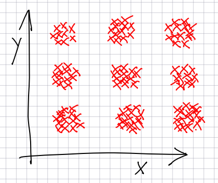

# Benchmarking the initialisation method
Generate a dataset similar to the one presented on the enclosed picture. 

  

Run on it a k-means clustering algorithm (with k=9) and the following initialisation methods:
- fully random;
- Forgy;
- random partition;
- k-means++.
Measure a chosen clustering quality metric (either Davies-Bouldin index, Dunn index, or Silhouette) after each algorithm iteration. 
Present the results on a plot (remember to repeat experiment multiple times and show the standard deviation of the values as errorbars). 

# Discovering the colour palette
Pick a nice, colourful photo. Treat each of its pixels as a data point in 3-D space (one dimension for red, green and blue value respectively). Perform the K-means clustering on this dataset with the following assumption:
- use representatives from the dataset as cluster centres instead of the mean values, as we do not want to have in our final palette colours that were not in the photography
Present the obtained palette (image represented by cluster representatives).  
