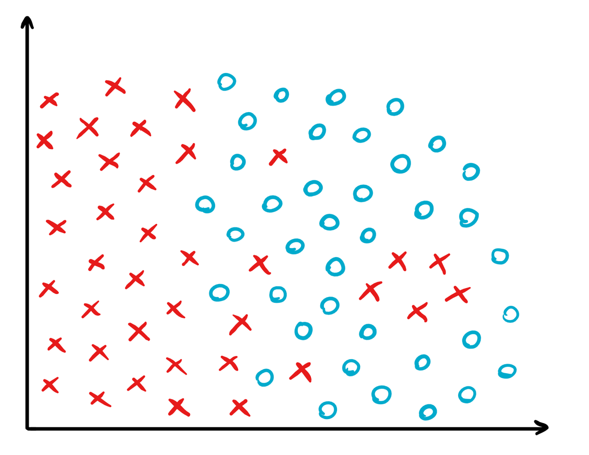

# Investigating SVM
Generate a distribution of data points similar to the one on the picture. 

  

For this distribution investigate how the decision boundary will behave depending on the C coefficient 
and whether or not the RBF kernel was employed (with different gamma coefficients). 
Check the margin width for each of those cases.

# Bagging
Take a dataset from UCI machine learning repository – use an interesting one.
Divide it into train and test parts with 70% to 30% ratio. 
Prepare four classifiers:
- two based on k-NN (with different k coefficient, distance metric, etc.), 
- two based on SVM (with different C coefficient, employed kernel, etc.). 
Train each of them with and without applying the bagging technique. 
Check and compare their accuracy (remember to repeat any stochastic parts of the experiment and report the standard variation of the results). 
